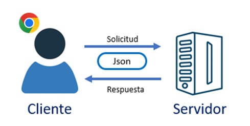
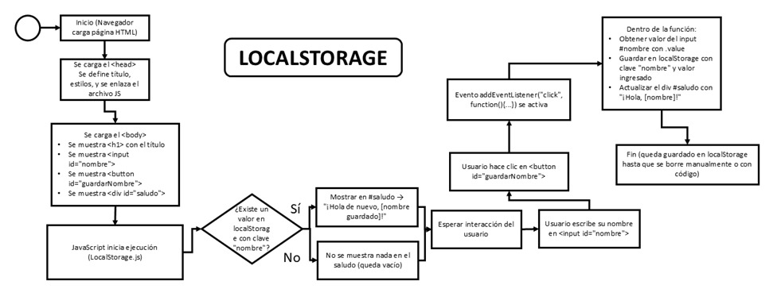
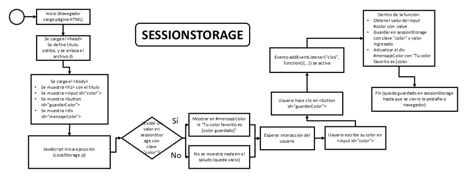

<h1 align="center">UNIVERSIDAD NACIONAL DEL CENTRO DEL PERÚ</h1>

<div align="center">   
    
</div>

<h2 align="center">
    <p>FACULTAD DE INGENIERÍA DE SISTEMAS</p>
    <p>DESARROLLO DE APLICACIONES WEB</p>
</h2>

<h2 align="center">
     JavaScript Básico
</h2>

**PRESENTADO POR:**

◼️Aranda Gomez Zarella Andrea

◼️Huaman Rojas Jhordan Armando

◼️Macha Pariona Angel Yoelver

◼️Mallqui Meza Jhamir Edu

◼️Quispe Ortiz Jhosep 

<h2 align="center">
    <p>HUANCAYO -- PERÚ</p>
    <p>2025</p>
</h2>

---

# ÍNDICE


[ÍNDICE]

[INTRODUCCIÓN]

[CAPITULO 1 - Introducción a JavaScript y su ejecución en navegadores]

[CAPITULO 2 - Variables y tipos de datos (String, Number, Boolean, Arrays, Objects)]

[CAPITULO 3 - Operadores (aritméticos, lógicos, comparación)]

[CAPITULO 4 - Condicionales (if, else, switch)]

[CAPITULO 5 - Bucles (for, while, do while) ]

[CAPITULO 6 - Funciones (declaración, expresiones, parámetros, retorno)]

[CAPITULO 7 - Manipulación del DOM (seleccionar elementos, modificar contenido, eventos)]

[CAPITULO 8 - Eventos y manejadores (addEventListener, onclick, etc.)]

[CAPITULO 9 - JSON y almacenamiento local (localStorage, sessionStorage)]

[CAPITULO 10 - Depuración y uso de la consola (console.log, debugger)]

[CONCLUSIÓN]

[REFERENCIA BIBLIOGRÁFICA]

# INTRODUCCIÓN

La siguiente monografía profundiza en el lenguaje de programación JavaScript, el cual permite dotar de interactividad y comportamiento dinámico a las páginas web, principalmente sobre documentos HTML y en conjunto con CSS. Gracias a JavaScript, la información presentada en un sitio puede responder a acciones del usuario, actualizar datos sin recargar la página, validar formularios, manipular elementos del DOM y comunicarse con servicios externos, entre otras funciones. Por su alcance y presencia en todos los navegadores modernos, JavaScript es un conocimiento fundamental para cualquier desarrollador web.

Por lo tanto, se tiene como objetivo comprender los fundamentos de JavaScript y su ejecución en el navegador. Para ello se revisarán conceptos esenciales como variables y tipos de datos, operadores, estructuras condicionales, bucles, funciones, así como la manipulación del DOM, la gestión de eventos, el uso de JSON y los mecanismos de almacenamiento en el navegador (localStorage y sessionStorage). Cada capítulo incluirá explicaciones claras y ejemplos prácticos que permitan conectar la teoría con situaciones reales de desarrollo.

Esta investigación resulta pertinente debido al papel central que JavaScript ocupa en el ecosistema web actual. Las organizaciones requieren interfaces más ágiles, accesibles y receptivas a la interacción del usuario, y ello se logra dominando las bases del lenguaje y las APIs del navegador. En el ámbito académico y profesional, el dominio de JavaScript es altamente demandado en el mercado laboral, beneficiando a desarrolladores front-end, diseñadores de experiencia de usuario y perfiles afines que necesitan comprender cómo se construyen aplicaciones web modernas.

El tipo de esta investigación será de carácter documental y descriptivo, ya que se recopilará y sistematizará información de fuentes técnicas confiables (documentación oficial y materiales de referencia reconocidos). A la vez, tendrá un componente exploratorio, puesto que se reforzará el aprendizaje mediante ejemplos de código y pequeños ejercicios que muestran la aplicación inmediata de los conceptos vistos en cada capítulo.

# CAPITULO 1 - Introducción a JavaScript y su ejecución en navegadores

## definición
A diferencia de los lenguajes compilados, JavaScript se interpreta directamente en el navegador mediante un motor interno, lo que permite ejecutar instrucciones en tiempo real mientras el usuario navega. Este enfoque posibilita que las páginas reaccionen a eventos del usuario sin necesidad de recargar todo el documento.

## Motores de JavaScript

Cada navegador cuenta con su propio motor, encargado de interpretar y ejecutar el código. Los principales son:

## Proceso de ejecución

El motor de JavaScript realiza tres etapas principales:
1. Parsing: Análisis del código fuente para convertirlo en un árbol de sintaxis.  
2. Compilación Just-In-Time (JIT): Traducción del código a instrucciones de máquina optimizadas.  
3. Ejecución: Interpretación línea por línea y manipulación del DOM (Document Object Model).

## Ejemplo de integración en HTML

```html
<!DOCTYPE html>
<html lang="es">
<head>
  <meta charset="UTF-8">
  <title>Ejemplo JavaScript con variables</title>
</head>
<body>
  <h1>Bienvenido</h1>
  <!-- Aquí pondremos el texto generado con JS -->
  <p id="mensaje"></p>
  
  <!-- Aquí pondremos el resultado de la suma -->
  <p id="resultado"></p>

  <script>
    // Variable tipo texto (string)
    let saludo = "Este texto fue generado con JavaScript";

    // Variables numéricas
    let numero1 = 7;
    let numero2 = 5;

    // Operación de suma
    let suma = numero1 + numero2;

    // Mostrar saludo en el párrafo con id="mensaje"
    document.getElementById("mensaje").innerText = saludo;

    // Mostrar resultado en el párrafo con id="resultado"
    document.getElementById("resultado").innerText = 
      "La suma de " + numero1 + " + " + numero2 + " es = " + suma;
  </script>
</body>
</html>
```

# CAPITULO 2 - Variables y tipos de datos en JavaScript

Las variables son espacios de memoria destinados a almacenar datos que serán utilizados en la ejecución del programa. En JavaScript pueden declararse de tres maneras:
var estudiante = true;   // Boolean

```

## Tipos de datos primitivos:

## String (cadenas de texto):

```javascript
let saludo = "Hola Mundo";

```

## Number (números enteros y decimales):

```javascript
let pi = 3.1416;
```

## Boolean (verdadero/falso):

```javascript
let activo = false;

```

## Undefined (sin valor asignado):

```javascript
let x;
console.log(x); // undefined

```

## Null (ausencia de valor):

```javascript
let y = null;
```

## Symbol (identificadores únicos):

```javascript
let id = Symbol("clave");
```

## BigInt (números enteros muy grandes):

```javascript
let big = 9007199254740991n;

```

## Tipos de datos estructurados (objetos):

Array: Colecciones ordenadas.

```javascript
let colores = ["rojo", "verde", "azul"];

```

Object: Estructuras clave-valor.

```javascript
let persona = {
  nombre: "Carlos",
  edad: 30,
  estudiante: true
};

```

El dominio correcto de variables y tipos de datos permite organizar, procesar y manipular información de manera eficiente, constituyendo la base de todo desarrollo en JavaScript.

# CAPITULO 3 - Teoría de Operadores en JavaScript

En JavaScript, los **operadores** permiten realizar operaciones sobre valores y variables. 
A continuación se describen los principales tipos de operadores: aritméticos, lógicos y de comparación.

---

## 1. Operadores Aritméticos
Se utilizan para realizar operaciones matemáticas.

| Operador | Descripción     | Ejemplo         | Resultado |
|:--------:|-----------------|-----------------|:---------:|
|   `+`    | Suma            | `5 + 3`         | 8         |
|   `-`    | Resta           | `5 - 3`         | 2         |
|   `*`    | Multiplicación  | `5 * 3`         | 15        |
|   `/`    | División        | `6 / 2`         | 3         |
|   `%`    | Módulo (resto)  | `5 % 2`         | 1         |
|   `**`   | Potencia        | `2 ** 3`        | 8         |
|   `++`   | Incremento      | `x = 5; x++`    | 6         |
|   `--`   | Decremento      | `x = 5; x--`    | 4         |

---

## 2. Operadores Lógicos
Se usan para combinar condiciones y devuelven un valor booleano (`true` o `false`).

Se usan para combinar condiciones y devuelven un valor booleano (`true` o `false`).

| Operador | Descripción | Ejemplo | Resultado |
|----------|-------------|---------|-----------|
| `&&`     | AND: verdadero si ambas condiciones son verdaderas | `(5 > 3) && (8 > 6)` | true |
| `II`     | OR: verdadero si al menos una condición es verdadera | `(5 > 3) \I\I (8 < 6)` | true |
| `!`      | NOT: invierte el valor lógico | `!(5 > 3)` | false |


---

## 3. Operadores de Comparación
Comparan valores y devuelven `true` o `false`.

| Operador | Descripción                                  | Ejemplo      | Resultado |
|:--------:|----------------------------------------------|--------------|:---------:|
| `==`     | Igual en valor (comparación débil)           | `5 == "5"`   | true      |
| `===`    | Igual en valor y tipo (comparación estricta) | `5 === "5"`  | false     |
| `!=`     | Diferente en valor                           | `5 != 3`     | true      |
| `!==`    | Diferente en valor o tipo                    | `5 !== "5"`  | true      |
| `>`      | Mayor que                                    | `7 > 5`      | true      |
| `<`      | Menor que                                    | `3 < 5`      | true      |
| `>=`     | Mayor o igual                                | `5 >= 5`     | true      |
| `<=`     | Menor o igual                                | `4 <= 5`     | true      |

---

## Nota sobre `==` y `===`
- `==` compara solo el valor, haciendo conversión de tipo si es necesario.
- `===` compara valor y tipo de dato sin conversión.
- Se recomienda usar `===` para evitar resultados inesperados.

---


# CAPÍTULO 4 – Teoría de Condicionales en JavaScript


Los **condicionales** en JavaScript permiten ejecutar diferentes bloques de código dependiendo de si una condición es verdadera o falsa.  
Son fundamentales para el control del flujo de un programa.

---

## 1. Estructura `if`
El condicional `if` ejecuta un bloque de código solo si la condición es **verdadera** (`true`).  
Si la condición es **falsa** (`false`), el bloque se omite.

**Sintaxis:**
```javascript
if (condicion) {
    // Código que se ejecuta si la condición es verdadera
}
```

**Ejemplo:**
```javascript
let edad = 18;
if (edad >= 18) {
    console.log("Eres mayor de edad");
}
```

---

## 2. Estructura `if...else`
Permite ejecutar un bloque si la condición es verdadera y otro si es falsa.

**Sintaxis:**
```javascript
if (condicion) {
    // Código si la condición es verdadera
} else {
    // Código si la condición es falsa
}
```

**Ejemplo:**
```javascript
let edad = 16;
if (edad >= 18) {
    console.log("Eres mayor de edad");
} else {
    console.log("Eres menor de edad");
}
```

---

## 3. Estructura `if...else if...else`
Se utiliza para evaluar múltiples condiciones en orden.  
El primer bloque cuya condición sea verdadera será ejecutado y los demás serán ignorados.

**Sintaxis:**
```javascript
if (condicion1) {
    // Código si condicion1 es verdadera
} else if (condicion2) {
    // Código si condicion2 es verdadera
} else {
    // Código si ninguna condición anterior es verdadera
}
```

**Ejemplo:**
```javascript
let nota = 15;
if (nota >= 18) {
    console.log("Excelente");
} else if (nota >= 14) {
    console.log("Aprobado");
} else {
    console.log("Reprobado");
}
```

---

## 4. Estructura `switch`
El condicional `switch` evalúa una expresión y la compara contra múltiples **casos**.  
Si encuentra coincidencia, ejecuta el código correspondiente a ese caso.

**Sintaxis:**
```javascript
switch (expresion) {
    case valor1:
        // Código si expresion === valor1
        break;
    case valor2:
        // Código si expresion === valor2
        break;
    default:
        // Código si no coincide con ningún caso
}
```

**Ejemplo:**
```javascript
let dia = 3;
switch (dia) {
    case 1:
        console.log("Lunes");
        break;
    case 2:
        console.log("Martes");
        break;
    case 3:
        console.log("Miércoles");
        break;
    default:
        console.log("Día no válido");
}
```

---

## Comparación y recomendaciones

- **`if`**: Úsalo cuando solo necesites evaluar una condición.
- **`if...else`**: Úsalo cuando haya dos posibles caminos de ejecución.
- **`if...else if...else`**: Úsalo para evaluar varias condiciones secuencialmente.
- **`switch`**: Úsalo cuando una sola variable o expresión deba ser comparada contra varios valores posibles.
- Evita escribir condicionales excesivamente anidados, ya que afectan la legibilidad.
- En `switch`, recuerda incluir `break` en cada caso para evitar la **caída de casos** (*fall-through*).
- Usa comparaciones estrictas (`===`) en vez de las débiles (`==`) para evitar errores de tipo.

---

## Ejemplo combinado
```javascript
let opcion = "B";


```

# CAPÍTULO 5 – Bucles (for, while, do…while)

## for clásico

Sirve para repetir un bloque un número conocido de veces (control por contador: inicialización → condición → actualización).

```javascript
const n = 5;
let suma = 0;
for (let i = 1; i <= n; i++) {
  suma += i;
}
console.log(suma); // 15

```

Variantes útiles


•	for...of: recorre valores de iterables (arrays, strings, Maps, Sets).

•	for...in: recorre claves (propiedades enumerables) —útil para objetos, con cuidado.

```javascript
// for...of (valores)
const nums = [3, 7, 2, 9];
let max = -Infinity;
for (const x of nums) {
  if (x > max) max = x;
}
console.log(max); // 9

// for...in (claves) en objetos
const persona = { nombre: "Ana", edad: 21 };
for (const key in persona) {
  if (Object.hasOwn(persona, key)) { // evita propiedades heredadas
    console.log(key, "→", persona[key]);
  }
}


```

Tip: Para objetos, muchas veces es más claro Object.entries(obj).forEach(([k,v]) => ...)
## Explicación gráfica 
En este ejemplo observaremos un caso sobre como definir una lista de personas y aplicar for ,  for ..of y for ... in
```javascript
var listaPersonas = [
 {"nombre": "pepe", "apellidos": "perez"},
 {"nombre": "ana", "apellidos": "gomez"},
 {"nombre": "almudena", "apellidos": "blanco"}
];
```


## while

Repite mientras la condición sea verdadera (puede ejecutarse 0 veces).

```javascript
// Factorial con while
const n = 5;
let r = 1, i = 2;
while (i <= n) {
  r *= i;
  i++;
}
console.log(r); // 120

```
Lo más clásico para poder ejecutar es usar un ciclo for 
```javascript
for (var i = 0; i < listaPersonas.length; i++) {
 console.log(listaPersonas[i].nombre);
 console.log(listaPersonas[i].apellidos);
}
```


Como seria utilizando el ciclo for ...of
```javascript
for (var persona of listaPersonas) {
console.log(persona.nombre);
console.log(persona.apellidos);
}
```


Como seria utilizando el ciclo for ... in 
```javascript
 for (var propiedad in listaPersonas) {
 // Imprime el valor de cada propiedad
 console.log(listaPersonas[propiedad]);
 }
```


## do…while

Ejecuta el bloque al menos una vez, y luego verifica la condición.

```javascript
// Ejecuta al menos una vez
let conteo = 0;
do {
  console.log("Paso", conteo);
  conteo++;
} while (conteo < 3);
// Imprime Paso 0, Paso 1, Paso 2

```

## break y continue

•	break sale por completo del bucle.

•	continue salta a la siguiente iteración.

```javascript
// Suma solo impares hasta encontrar el 0
const datos = [5, 3, 8, 11, 0, 7];
let sumaImpares = 0;
for (const n of datos) {
  if (n === 0) break;       // corto el bucle
  if (n % 2 === 0) continue; // salto pares
  sumaImpares += n;
}
console.log(sumaImpares); // 5 + 3 + 11 = 19

```

Errores comunes: bucles infinitos (while(true) sin break), modificar el array mientras lo recorres, usar for...in en arrays (te da índices como strings y puede incluir propiedades añadidas).

# CAPÍTULO 6 - Funciones (declaración, expresiones, parámetros, retorno)

## Declaración de función

•	Tiene hoisting: puedes llamarla antes de su definición.

```javascript
console.log(suma(2, 3)); // 5
function suma(a, b) {
  return a + b;
}

```

## Expresión de función

•	Se asigna a una variable. No puedes usarla antes de la línea donde se define.

```javascript
const resta = function(a, b) {
  return a - b;
};
console.log(resta(7, 4)); // 3

```

## Arrow function (=>)

•	Sintaxis corta; no tiene su propio this ni arguments. No sirve como constructor.

```javascript
const mult = (a, b) => a * b;          // retorno implícito
const cuadrado = x => x * x;           // un parámetro → sin paréntesis
const toObj = (k, v) => ({ [k]: v });  // devolver objeto → usa paréntesis
console.log(mult(3, 4), cuadrado(5), toObj("id", 10));

```

## Parámetros

### Valores por defecto

```javascript
function saludar(nombre = "Invitado", idioma = "es") {
  return idioma === "es" ? `Hola, ${nombre}` : `Hello, ${nombre}`;
}
console.log(saludar());                // Hola, Invitado
console.log(saludar("Ana", "en"));     // Hello, Ana

```

## Parámetros rest (...)

### Agrupa argumentos adicionales en un array.

```javascript
function sumarTodos(...nums) {
  return nums.reduce((acc, n) => acc + n, 0);
}
console.log(sumarTodos(1, 2, 3, 4)); // 10

```

### Desestructuración en parámetros (con defaults)

Ideal para “parámetros nombrados” mediante objeto.

```javascript
function crearUsuario({ nombre, rol = "user", activo = true }) {
  return { nombre, rol, activo, creadoEn: new Date() };
}
console.log(crearUsuario({ nombre: "Ana", rol: "admin" }));

```

## Retorno (return)

•	Finaliza la función y devuelve un valor.

•	Puedes retornar objetos/arrays para “múltiples valores”.

```javascript
function dividir(a, b) {
  if (b === 0) return { ok: false, error: "División por cero" };
  return { ok: true, resultado: a / b };
}
console.log(dividir(10, 2)); // { ok: true, resultado: 5 }
console.log(dividir(5, 0));  // { ok: false, error: ... }

```
# CAPÍTULO 7 - Manipulación del DOM

## Concepto

El **DOM (Document Object Model)** es una interfaz de programación que representa el documento HTML como un árbol de nodos. 
Cada etiqueta (`<div>`, `<p>`, `<h1>`, etc.) se convierte en un nodo que puede ser manipulado con JavaScript. Es por eso que podemos:

- Seleccionar elementos de la página.

- Modificar su contenido o estilo.

- Responder a eventos del usuario como clics, movimientos del mouse o teclas presionadas.

-----------------

### Ejemplo de DOM:

Es un método en JavaScript es fundamental para la gestión de eventos en el desarrollo web, que permite asociar una función para que se ejecute cada vez que se entrega un evento específico a un elemento de destino en el DOM.

**Código HTML:**

Este código es un ejemplo práctico del uso del DOM (Document Object Model). El objetivo es mostrar cómo una página web puede volverse interactiva al modificar elementos HTML.

```html
<!DOCTYPE html>
<html lang="es">
<head>
  <meta charset="UTF-8">
  <title>Ejemplo Completo DOM</title>
  <style>
    body {
      font-family: Arial, sans-serif;
      text-align: center;
      margin-top: 50px;
    }
    #titulo {
      color: darkblue;
    }
    #parrafo {
      font-size: 18px;
      color: gray;
    }
    button {
      margin: 10px;
      padding: 8px 15px;
      font-size: 16px;
      cursor: pointer;
    }
  </style>
</head>
<body>
  <h1 id="titulo">Bienvenido al DOM ✨</h1>
  <p id="parrafo">Este texto puede cambiar con JavaScript.</p>

  <button id="btnTexto">Cambiar Texto</button>
  <button id="btnColor">Cambiar Color</button>
  <button id="btnOcultar">Ocultar/Mostrar Párrafo</button>

  <!-- Conexión al script -->
  <script src="script.js"></script>
</body>
</html>
```

**Código JAVASCRIPT:** 

Este código usa JavaScript y el DOM,  con tres botones se puede cambiar el texto de un párrafo, alternar el color del título y ocultar o mostrar el párrafo, todo mediante eventos click.

```javascript
// 1. Seleccionar elementos
const titulo = document.getElementById("titulo");
const parrafo = document.querySelector("#parrafo"); // otra forma de seleccionar
const btnTexto = document.getElementById("btnTexto");
const btnColor = document.getElementById("btnColor");
const btnOcultar = document.getElementById("btnOcultar");

// 2. Modificar contenido y estilos con eventos
btnTexto.addEventListener("click", () => {
  parrafo.textContent = "¡El contenido ha cambiado con el DOM! 🎉";
});

btnColor.addEventListener("click", () => {
  titulo.style.color = titulo.style.color === "darkblue" ? "crimson" : "darkblue";
});

btnOcultar.addEventListener("click", () => {
  if (parrafo.style.display === "none") {
    parrafo.style.display = "block";
  } else {
    parrafo.style.display = "none";
  }
});
```

## Resultado:

El usuario puede modificar dinámicamente el texto, color y visibilidad de los elementos de la página con solo hacer clic en los botones.

# CAPITULO 8 - Eventos y Manejadores (addEventListener, onclick)

## Concepto

En JavaScript, un **evento** es una acción que ocurre en la página (clic, movimiento del mouse, teclado, scroll, etc.).  
Un **manejador de eventos** es la función que se ejecuta cuando ocurre esa acción.

------------

### EVENTOS (addEventListener):

Es un método en JavaScript es fundamental para la gestión de eventos en el desarrollo web, que permite asociar una función para que se ejecute cada vez que se entrega un evento específico a un elemento de destino en el DOM.

**Código HTML:**

Este código crea una página con un botón y un párrafo. Cuando presionas el botón, gracias al addEventListener en el archivo a **add.js**, el texto del párrafo cambia dinámicamente.

```html
<!DOCTYPE html>
<html lang="es">
<head>
    <meta charset="UTF-8">
    <meta name="viewport" content="width=device-width, initial-scale=1.0">
    <title>Ejemplo addEventListener</title>
    <style>
        body {
            font-family: Arial, sans-serif;
            text-align: center;
            margin-top: 50px;
        }
        #btn {
            background-color: #4CAF50;
            color: white;
            border: none;
            padding: 12px 20px;
            font-size: 16px;
            border-radius: 8px;
            cursor: pointer;
        }
        #btn:hover {
            background-color: #45a049;
        }
        #texto {
            margin-top: 20px;
            font-size: 18px;
            color: #333;
        }
    </style>
</head>
<body>
    <h2>Ejemplo con <code>addEventListener</code></h2>
    <button id="btn">Haz clic aquí</button>
    <p id="texto">Aquí aparecerá el mensaje...</p>

    <script src="add.js"></script>
</body>
</html>
```

**Código JAVASCRIPT:** 

Usa addEventListener para escuchar tres tipos de eventos en el botón:

- click → cambia texto a azul y en negrita.
- mouseover → muestra mensaje en color naranja.
- mouseout → muestra mensaje en color rojo.
 

```javascript
const boton = document.getElementById("btn");
const texto = document.getElementById("texto");

// Evento para cambiar el texto
boton.addEventListener("click", () => {
    texto.textContent = "¡Genial! Usaste addEventListener";
    texto.style.color = "blue"; // cambia color
    texto.style.fontWeight = "bold"; // lo pone en negrita
});

// Otro evento: Cuando se pasa el mouse por encima
boton.addEventListener("mouseover", () => {
    texto.textContent = "Estás pasando el mouse por el botón";
    texto.style.color = "orange";
});

// Otro evento: Cuando se quita el mouse
boton.addEventListener("mouseout", () => {
    texto.textContent = "Quitaste el mouse del botón";
    texto.style.color = "red";
});
```
------------

### Manejadores (onclick):

Es un atributo de eventos en JavaScript que permite ejecutar una función cuando un usuario hace clic en un elemento HTML, como un botón.

**Código HTML:**

Aquí se usa el atributo HTML **onclick** directamente en el botón.

```html
<!DOCTYPE html>
<html lang="es">
<head>
    <meta charset="UTF-8">
    <title>Ejemplo ONCLICK</title>
</head>
<body>
    <h1>Ejemplo con ONCLICK</h1>

    <button onclick="mostrarMensaje()">Click aquí</button>
    <p id="texto">Aquí aparecerá el mensaje...</p>

    <script src="on.js"></script>
</body>
</html>
```

**Código JAVASCRIPT:**

Se utiliza onclick:

- El botón tiene onclick = "mostrarMensaje()".
- Cuando haces clic, se ejecuta la función mostrarMensaje().
- La función busca el párrafo con id texto y cambia su contenido.
 

```javascript
function mostrarMensaje() {
    document.getElementById("texto").textContent = "Hiciste click con ONCLICK";
}
```

------------

# CAPITULO 9 - JSON y almacenamiento local (localStorage, sessionStorage)
## Json(JavaScript Object Notation) 

JSON (JavaScript Object Notation) es un formato ligero de intercambio de datos basado en pares clave-valor. Es sencillo de leer por humanos y fácil de interpretar por máquinas. En JavaScript se utiliza ampliamente para almacenar y transferir información. Sus métodos principales son:
-	JSON.stringify(): convierte un objeto en una cadena JSON.
-	JSON.parse(): convierte una cadena JSON en un objeto de JavaScript.
## Relación cliente y servidor


### Código Html
1) Aquí se arma la estructura básica. En los estilos se define la letra, el espacio entre elementos y se pone un fondo gris con bordes redondeados al bloque
   ```<pre>``` donde se mostrarán los usuarios.
```html
<!DOCTYPE html>
<html lang="es">
<head>
  <meta charset="UTF-8">
  <title>Ejemplo JSON + LocalStorage</title>
  <style>
    body { font-family: Arial, sans-serif; padding: 20px; }
    input, button { margin: 5px; padding: 5px; }
    pre { background: #f4f4f4; padding: 10px; border-radius: 5px; }
  </style>
</head>
<body>
  <h2>Usuarios en JSON (con LocalStorage)</h2>
```
2) Este es el formulario donde el usuario escribe su nombre y edad. El botón permite enviar esos datos.
   ```html
   <form id="formUsuario">
    <input type="text" id="nombre" placeholder="Nombre" required>
    <input type="number" id="edad" placeholder="Edad" required>
    <button type="submit">Agregar Usuario</button>
    </form>
   ```
3) Aquí se reserva un espacio con  pre para mostrar en pantalla la lista de usuarios en JSON.
   ```html
    <h3>Lista de usuarios:</h3>
     <pre id="salida"></pre>

   ```
4) Finalmente se enlaza el JavaScript, que es el que maneja la lógica y los datos.
```html
    <script src="Json2.js"></script>
</body>
</html>
 ```

### Código JavaScript
5) Primero se revisa si ya hay datos guardados en localStorage. Si no hay, se cargan dos usuarios de ejemplo.
  ```javascript
let usuarios = JSON.parse(localStorage.getItem("usuarios")) || [
  { id: 1, nombre: "Ana", edad: 23 },
  { id: 2, nombre: "Carlos", edad: 30 }
];
```
6) Esta función convierte la lista de usuarios en texto JSON y lo pone dentro del pre en pantalla.
   function mostrarUsuarios() {
 ```javascript
let texto = JSON.stringify(usuarios, null, 2); 
  document.getElementById("salida").textContent = texto;
}
```
7) Apenas carga la página, se ejecuta para mostrar la lista.
   ```javascript
   mostrarUsuarios();
   ```
9) Aquí está la parte clave: cuando se envía el formulario, se evita la recarga de página, se crean los datos del nuevo usuario, se agrega al arreglo. Después se actualiza la lista en pantalla y se limpia el formulario.
  ```javascript
document.getElementById("formUsuario").addEventListener("submit", function(e) {
  e.preventDefault();
  let nombre = document.getElementById("nombre").value;
  let edad = parseInt(document.getElementById("edad").value);
  let nuevoUsuario = {
    id: usuarios.length + 1,
    nombre: nombre,
    edad: edad
  };
  usuarios.push(nuevoUsuario);
  mostrarUsuarios();
  this.reset();
});
```
## localStorage y sessionStorage
| Almacenamiento | Descripción |
|----------------|------------|
| **localStorage** | Mecanismo que permite guardar información en el navegador de manera **permanente**. Los datos **no se eliminan al cerrar la pestaña o el navegador**, solo si se borran manualmente. Se utiliza para guardar configuraciones, preferencias o información que debe mantenerse entre visitas. |
| **sessionStorage** | Funciona de manera similar a `localStorage`, pero los datos se conservan **solo durante la sesión**. Al cerrar la pestaña o ventana, la información se borra automáticamente. Es útil para almacenar datos temporales, como información de navegación o un carrito de compras en una sola sesión. |
### Código Html
1) El documento comienza con la estructura de HTML y un bloque de estilos. Allí se define la tipografía Arial, márgenes y relleno para inputs y botones, además de .caja como un contenedor con borde y espacio. Esto sirve para dar orden y presentación sencilla a la página.
```html
   <!DOCTYPE html>
<html lang="es">
<head>
  <meta charset="UTF-8">
  <title>Ejemplo localStorage y sessionStorage</title>
  <style>
    body { font-family: Arial, sans-serif; padding: 20px; }
    input { margin: 5px 0; padding: 5px; }
    button { margin: 5px; padding: 5px 10px; }
    .caja { margin-top: 15px; padding: 10px; border: 1px solid #ccc; }
  </style>
  
</head>
```
2) En el body se crean dos secciones. La primera permite ingresar un nombre que se guarda en localStorage, mientras que la segunda permite ingresar un color favorito que se guarda en sessionStorage. Cada una tiene un input, un botón y un párrafo que se actualizará dinámicamente con el dato ingresado.
```html
   <body>
  <h1>Ejemplo con localStorage y sessionStorage</h1>
  <div class="caja">
    <h3>Nombre (localStorage)</h3>
    <input type="text" id="nombre" placeholder="Escribe tu nombre">
    <button id="guardarNombre">Guardar nombre</button>
    <p id="saludo"></p>
  </div>
  <div class="caja">
    <h3>Color favorito (sessionStorage)</h3>
    <input type="text" id="color" placeholder="Escribe tu color favorito">
    <button id="guardarColor">Guardar color</button>
    <p id="mensajeColor"></p>
  </div>
  <script src="LocalStorage.js"></script>
</body>
</html>
```
### Código JavaScript
3) El JavaScript primero revisa si ya hay datos guardados. En el caso de localStorage, si existe un nombre guardado, se muestra un saludo personalizado. Luego, cuando se hace clic en el botón, el nombre ingresado se guarda en localStorage y se actualiza en pantalla.

```javascript
  if(localStorage.getItem("nombre")){
    document.getElementById("saludo").textContent =
    "¡Hola de nuevo, " + localStorage.getItem("nombre") + "!";
}

document.getElementById("guardarNombre").addEventListener("click", function(){
  let nombre = document.getElementById("nombre").value;
  localStorage.setItem("nombre", nombre);
  document.getElementById("saludo").textContent = "¡Hola, " + nombre + "!";
});

  ```
    
4) Con el color favorito se hace lo mismo, pero usando sessionStorage. Si había un valor en la sesión, se muestra al cargar la página. Si el usuario ingresa uno nuevo y da clic en el botón, ese valor se guarda en la sesión y se refleja en pantalla.
```javascript
if(sessionStorage.getItem("color")){
  document.getElementById("mensajeColor").textContent =
    "Tu color fav en esta sesión es: " + sessionStorage.getItem("color");
}

document.getElementById("guardarColor").addEventListener("click", function(){
  let color = document.getElementById("color").value;
  sessionStorage.setItem("color", color);
  document.getElementById("mensajeColor").textContent =
    "Tu color favorito en esta sesión es: " + color;
});
```
### Diagrama de flujo LocalStorage



### Diagrama de flujo SessionStorage


# CAPITULO 10 - Depuración y uso de la consola (console.log, debugger)
## Depuración 
La depuración es el proceso de identificar y corregir errores en el código. En JavaScript, se puede utilizar la palabra clave debugger, la cual detiene la ejecución del programa y permite inspeccionar el estado de las variables y el flujo del código.
## Uso de consola
La consola del navegador es una herramienta esencial para la depuración. Con console.log() se muestran valores o mensajes que permiten comprobar el funcionamiento del programa. Además, existen otros métodos útiles como console.error() para errores, console.warn() para advertencias y console.table() para mostrar datos en forma de tabla. Estas funciones ayudan a tener una mejor visualización durante el análisis del código.
### Código en Html
1) Se define la codificación de caracteres, el título de la página y el estilo básico. Los inputs y botones tienen márgenes y padding para verse ordenados, el body tiene espacio interno y el párrafo del resultado se destaca con negrita.
```html
   <!DOCTYPE html>
<html lang="es">
<head>
  <meta charset="UTF-8">
  <title>Prueba de depuración JS</title>
  <style>
    body { font-family: Arial, sans-serif; padding: 20px; }
    input { margin: 5px 0; padding: 5px; width: 50px; }
    button { margin: 10px 0; padding: 5px 10px; }
    p { margin-top: 10px; }
  </style>
</head>
```

2) Se crean dos cajas de texto donde el usuario puede ingresar números, un botón para ejecutar la suma y un párrafo vacío donde luego se mostrará el resultado. El h1 da el título visible de la página.
```html
   <body>
  <h1>Ejemplo de depuración con console.log y debugger</h1>

  <label for="valor1">Valor 1:</label>
  <input type="number" id="valor1" value="5">
  <br>
  <label for="valor2">Valor 2:</label>
  <input type="number" id="valor2" value="7">
  <br>
  <button id="calcular">Calcular suma</button>

  <p id="resultado"></p>
  ```


3) Se enlaza el archivo externo UsoDeConsola.js que contiene toda la lógica de la función de suma, los console.log y el debugger. Esto separa la lógica del HTML, manteniendo el código ordenado.
```html
    <script src="UsoDeConsola.js"></script>
</body>
</html>
```
  
### Código en Javascript
4) La función recibe dos números, imprime sus valores en la consola, pausa la ejecución con debugger para inspección, calcula la suma y la muestra en consola. Luego devuelve el resultado para usarlo fuera de la función.
```javascript
   function suma(a, b) {
  console.log("Valores recibidos:", a, b); 
  debugger; 
  let resultado = a + b;
  console.log("Resultado de la suma:", resultado);
  return resultado;
}
```
    
5) Cuando el usuario hace clic en el botón, se toman los valores de los inputs, se convierten a números, se llama a la función suma, y finalmente se muestra el resultado tanto en consola como en el párrafo de la página. Esto conecta la interfaz con la lógica de cálculo y depuración.
```javascript
   document.getElementById("calcular").addEventListener("click", function() {
  let valor1 = parseInt(document.getElementById("valor1").value);
  let valor2 = parseInt(document.getElementById("valor2").value);
  let total = suma(valor1, valor2);
  console.log("Total final:", total); // Valor final en consola
  document.getElementById("resultado").textContent = "Total: " + total;
});
```
# CONCLUSIÓN

El estudio realizado permite afirmar que JavaScript es un pilar imprescindible del desarrollo web moderno. A lo largo de la monografía se abordaron sus fundamentos (variables, tipos, operadores, condicionales y bucles), se revisó la declaración y uso de funciones y se demostró cómo, a través de la manipulación del DOM y el manejo de eventos, es posible transformar páginas estáticas en interfaces interactivas enfocadas en la experiencia del usuario. Además, se introdujo el uso de JSON para el intercambio de datos y los mecanismos de almacenamiento local del navegador, recursos clave para mantener información entre sesiones y construir prototipos funcionales sin necesidad de un servidor inmediato.

Entre los aprendizajes más relevantes destacan: (1) la importancia de utilizar comparaciones estrictas y buenas prácticas en control de flujo para evitar errores sutiles; (2) el valor de estructurar el código en funciones claras y reutilizables; (3) el uso del DOM y los eventos como puente entre la lógica y la interfaz; y (4) la utilidad de console.log y debugger como herramientas de depuración que facilitan identificar problemas y comprender el comportamiento del programa paso a paso.

Los beneficios de dominar estos conceptos se reflejan en la construcción de aplicaciones más mantenibles, accesibles y eficientes, con tiempos de respuesta adecuados y una interacción más fluida para el usuario. Asimismo, el estudio sienta una base sólida para continuar con contenidos de mayor complejidad, como módulos, promesas y async/await, APIs del navegador, frameworks y pruebas, consolidando un camino de aprendizaje progresivo.

En conclusión, asimilar los fundamentos de JavaScript no es opcional sino indispensable para el desarrollo de aplicaciones web actuales. Integrar estas prácticas desde el inicio del proceso formativo permite escribir código más claro y robusto, mejorar la experiencia del usuario y responder a las exigencias técnicas del entorno digital contemporáneo.


# REFERENCIA BIBLIOGRÁFICA

- Manz. (s. f.). ¿Qué es CSS? En LenguajeCSS.com. https://lenguajecss.com/css/introduccion/que-es-css/
- ManzDev. (2017, 5 de abril). Variables CSS: CSS Custom Properties. https://lenguajecss.com/css/variables-css/css-custom-properties/
- World Wide Web Consortium (s. f.). About us. W3C. https://www.w3.org/about/
- A. Vázquez Sanisidro, Optimización de Páginas Web: Visión teórica y análisis práctico, Tesis de Grado, Dpto. de Ingeniería Telemática, Univ. de Sevilla, Sevilla,     España, 2017.
- Coyier, C. (2021). *Clipping and Masking in CSS*. CSS-Tricks. Recuperado de https://css-tricks.com/clipping-masking-css/  
- Meyer, E. A. (2018). *CSS: The Definitive Guide* (4.ª ed.). O’Reilly Media.  
- Mozilla Developer Network (MDN). (2022). *clip-path*. Mozilla Foundation. Recuperado de https://developer.mozilla.org/es/docs/Web/CSS/clip-path  
- Mozilla Developer Network (MDN). (2022). *mask-image*. Mozilla Foundation. Recuperado de https://developer.mozilla.org/es/docs/Web/CSS/mask-image
- Keith, J. (2020). *A complete guide to CSS Scroll Snap*. CSS-Tricks. Recuperado de https://css-tricks.com/practical-guide-to-scroll-snap/  
- Mozilla Developer Network (MDN). (2022). *CSS Scroll Snap*. Mozilla Foundation. Recuperado de https://developer.mozilla.org/es/docs/Web/CSS/CSS_Scroll_Snap  
- W3C. (2019). *CSS Scroll Snap Module Level 1*. World Wide Web Consortium. Recuperado de https://www.w3.org/TR/css-scroll-snap-1/
- Manz. (s. f.).  Filtros CSS En LenguajeCSS.com.https://lenguajecss.com/css/efectos/filtros-css/
- Manz. (s. f.). CSS Container Queries En LenguajeCSS.com.https://lenguajecss.com/css/responsive-web-design/css-container-queries/
